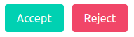

.. `layouts`:

=======
Layouts
=======

Bulma Layout objects
~~~~~~~~~~~~~~~~~~~~

The layout objects below are either bulma specific or have been modified to support bulma. The complete list of all layout objects can be found `here`_.

.. _here: https://django-crispy-forms.readthedocs.io/en/latest/layouts.html#universal-layout-objects

These ones live under module ``crispy_bulma.layouts``.

- **Button**: Creates a button::

    Button('Delete', css_class='is-danger')

Renders to::

    <button class="button is-danger">Delete</button>

- **Submit**: Used to create a submit button. First parameter is the ``name`` attribute of the button, second parameter is the ``value`` attribute::

    Submit('search', 'SEARCH')

Renders to::

    <input type="submit" class="button" name="search" value="SEARCH" id="submit-id-search" />

- **Hidden**: Used to create a hidden input::

    Hidden('name', 'value')

- **Reset**: Used to create a reset input::

    Reset('name', 'value')

- **FormGroup**: It wraps fields in a ``
``. It is usually used to wrap form's buttons::

    FormGroup(
        Submit('accept', 'Accept'),
        Button('Reject')
    )

- **IconField**: It renders an input with optional icon left and/or icon right. Note that `IconField`
  also supports an `icon_append` keyword argument. This field has been tested only with font-awesome icons::

    IconField('field_name', icon_prepend="fa-solid fa-envelope")

.. image:: images/icon_field.png
   :align: center

These ones live under module ``crispy_bulma.bulma``.

- **InlineCheckboxes**: It renders a Django ``forms.MultipleChoiceField`` field using inline checkboxes::

    InlineCheckboxes('field_name')

.. image:: images/inline_checkboxes.png
   :align: center

- **InlineRadios**: It renders a Django ``forms.ChoiceField`` field with its widget set to ``forms.RadioSelect`` using inline radio buttons::

    InlineRadios('field_name')

.. image:: images/inline_radios.jpg
   :align: center
