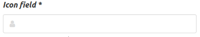

.. `layouts`:

=======
Layouts
=======

Bulma Layout objects
~~~~~~~~~~~~~~~~~~~~

The layout objects below are bulma specific. The complete list of all layout objects can be found `here`_.

.. _here: https://django-crispy-forms.readthedocs.io/en/latest/layouts.html#universal-layout-objects

These ones live under module ``crispy_bulma.layouts``.

- **IconField**: It renders an input with optional icon left and/or icon right. Note that `IconField`
  also supports an `icon_append` keyword argument. This field has been tested only with font-awesome icons::

    IconField('field_name', icon_prepend="fa-solid fa-envelope")

These ones live under module ``crispy_bulma.bulma``.

- **InlineCheckboxes**: It renders a Django ``forms.MultipleChoiceField`` field using inline checkboxes::

    InlineCheckboxes('field_name')

.. image:: images/inline_checkboxes.png
   :align: center

- **InlineRadios**: It renders a Django ``forms.ChoiceField`` field with its widget set to ``forms.RadioSelect`` using inline radio buttons::

    InlineRadios('field_name')

.. image:: images/inline_radios.jpg
   :align: center
